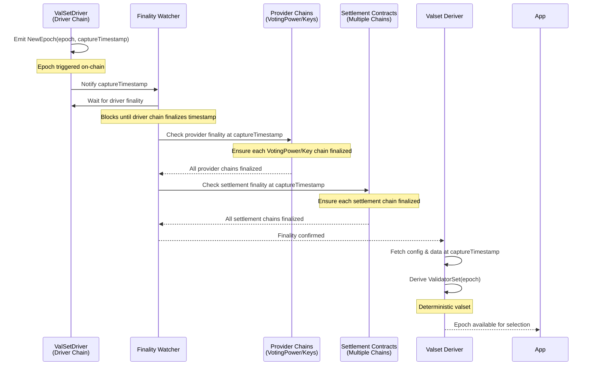
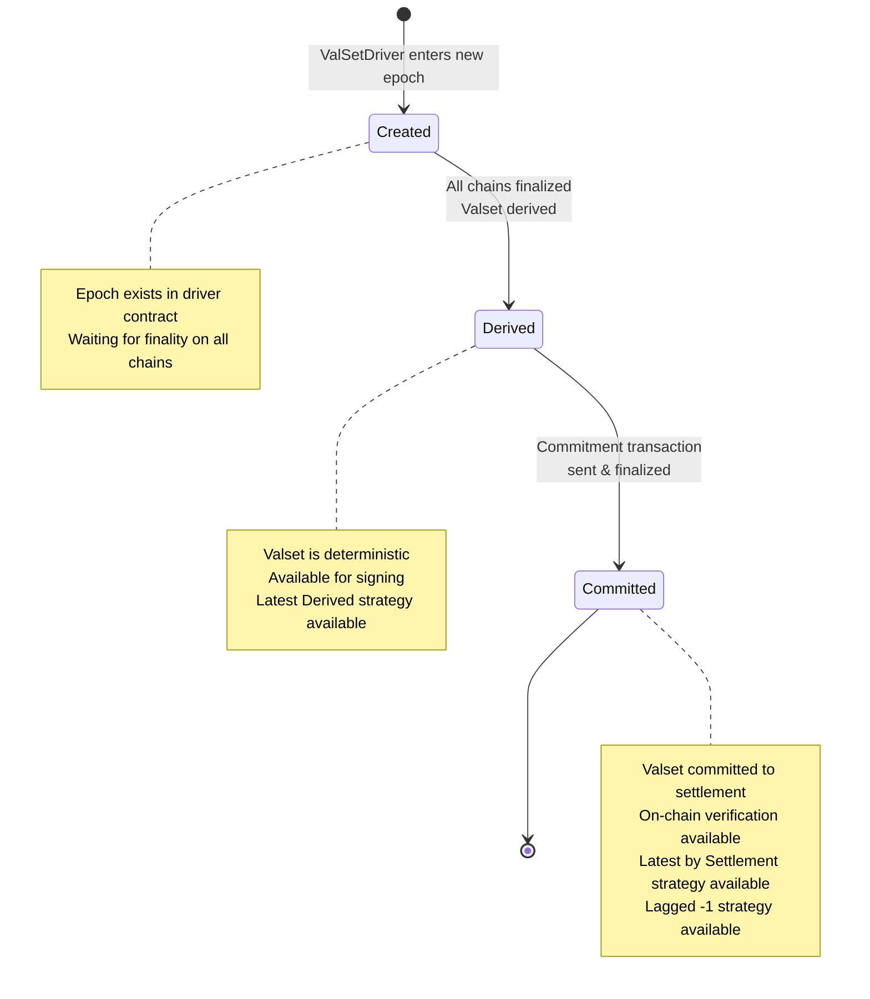

# Epoch Progression

## Description

Epoch progression defines how the relay observes new epochs from `ValSetDriver` contract, waits for finality on every chain that contributes data, and derives deterministic validator sets. Multiple epochs can be in-flight simultaneously, and application builders must decide which epoch is considered “active” for their use case.

**See also**:
- [`ValidatorSet`](./types.md#validatorset) for the resulting structure
- [`NetworkConfig`](./types.md#networkconfig) for the data required to derive the set

## Key Concepts

- **Epoch Capture Timestamp**: Each epoch specifies a capture timestamp that serves as the canonical point-in-time for fetching voting power, keys, and other data. All derivations use this timestamp.
- **Finality Requirements**: The capture timestamp must be finalized on both the driver chain and every provider chain (VotingPowerProvider, KeyRegistry, Settlement) before the epoch can be derived. Until finality is confirmed, the epoch remains pending.
- **Slashable Epochs**: If an epoch’s capture timestamp falls within a vault’s slashing window (equal to its epoch duration), multiple epochs can be slashable concurrently. The relay retains all epochs whose timestamps intersect active slashing windows.
- **Active Epoch Selection**: It is up to downstream applications (“app builders”) to decide which epoch to treat as active. Common strategies are listed [below](#active-epoch-selection).

## Process Overview

1. **Driver Epoch Triggered**: The `ValSetDriver` enters to a new epoch by current timestamp.
2. **Driver Finality**: The relay waits until the capture timestamp is finalized on the driver chain. Reorgs before finality are ignored.
3. **Provider Finality**: The relay verifies that every required provider chain (VotingPowerProviders, KeyRegistry) has finalized blocks covering the capture timestamp.
4. **Derivation**: Once finality is confirmed everywhere, the relay derives the validator set for that epoch using the capture timestamp, producing a deterministic `ValidatorSet`.
5. **Retention / Slashing Window**: Epochs remain slashable for the duration of the vault’s epoch window. Multiple overlapping epochs can exist; the relay keeps them available for signing.
6. **Settlement commitment**: Epoch is committed in settlement contract and available for on-chain verification.
6. **Application Consumption**: App builders select which derived epoch to treat as active depending on their logic.

## Sequence Diagram

## Epoch Lifecycle

The following state machine diagram illustrates the progression of an epoch through its three main stages:

## Practical Notes

- **Finality Sources**: The relay uses finalized block numbers (e.g., `rpc.FinalizedBlockNumber` for EVM chains). Operators should tune RPC endpoints to ensure up-to-date finality signals.
- **Multiple Slashable Epochs**: Because capture timestamps may overlap slashing windows, keep storage for all recent epochs whose timestamps are within any vault’s slashing duration.
- **Error Handling**: If any provider chain fails to finalize, the epoch remains pending and derivation retries later. Epoch IDs never regress; they remain ordered even if finality lags.

## Active Epoch Selection

Application builders must decide which epoch to treat as "active" for their use case. The choice depends on the application's requirements for on-chain verification, tolerance for timing risks, and need for settlement contract readiness.

### Selection Strategies

#### Latest Derived

Use the newest epoch that has passed finality on all required chains (driver and provider chains). At this point, the valset is deterministic and available for signing operations.

**Characteristics:**
- **Valset Status**: Derived and finalized, ready for signing
- **Settlement Status**: May not yet be committed to settlement contracts
- **On-Chain Verification**: Proofs cannot be verified on-chain until commitment is finalized
- **Use Cases**: 
  - Applications that sign messages but don't immediately verify proofs on-chain
  - Off-chain operations that need the latest validator set or if on-chain verification is not required

**Discovery**: Can use [`GetCurrentEpoch`](../api/v1/doc.md#getcurrentepochrequest) API method

#### Lagged (Latest - 1)

Use the epoch that is one behind the latest derived epoch. This strategy ensures that the valset header has been most likely committed to all required settlement contracts and provides a safety buffer against edge timing risks.

**Characteristics:**
- **Valset Status**: Derived, finalized, and most likely committed to settlement contracts
- **Settlement Status**: Likely committed and finalized on settlement chains
- **On-Chain Verification**: Proofs can be verified on-chain immediately
- **Use Cases**:
  - Applications that requires immediate on-chain verification but can tolerate minial risks of missed header commitment.

**Discovery**: Can use [`GetCurrentEpoch`](../api/v1/doc.md#getcurrentepochrequest) API method.

#### Latest by Settlement

Use the latest epoch that is logged on-chain in a specific settlement contract. This approach queries the settlement contract directly to determine the most recent committed epoch.

**Characteristics:**
- **Valset Status**: Committed and finalized on the target settlement chain
- **Settlement Status**: Confirmed on-chain via contract query
- **On-Chain Verification**: Guaranteed to be verifiable on the queried chain
- **Use Cases**:
  - Applications that requires guaranteed immediate on-chain verification

**Discovery**: Can use [`GetLastAllCommitted`](../api/v1/doc.md#getlastallcommittedrequest) or [`GetLastCommitted`](../api/v1/doc.md#getlastcommittedrequest) API methods.

#### Custom

Filter epochs by application-specific criteria beyond finality and commitment status.

**Common Criteria:**
- **Aggregator Availability**: Ensure sufficient aggregator nodes are online
- **Voting Power Threshold**: Require minimum total voting power
- **Validator Count**: Require minimum number of active validators
- **Time-Based**: Use epochs within a specific time window
- **Chain-Specific**: Ensure commitment on specific settlement chains

**Use Cases:**
- Applications with specific security or operational requirements
- Multi-chain applications with complex verification needs
- Systems that need to ensure operational readiness before using an epoch

**Discovery**: Check API [reference](../api/v1/doc.md) to justify most suitable method.

### Comparison Table

| Strategy | Valset Deterministic | Off-Chain Verification | On-Chain Verification | 
|----------|------------------|----------------------|-----------|
| **Latest Finalized** | ✅ Yes |  ✅ Guaranteed | ❌ Not available
| **Lagged (Latest - 1)** | ✅ Yes  | ✅ Guaranteed | ✅  Likely
| **Latest by Settlement** | ✅ Yes | ✅ Guaranteed | ✅ Guaranteed
| **Custom** | ✅ Yes | Varies | Varies | Varies 

## References

- [`Valset Derivation`](./valset_derivation.md) for the derivation pipeline
- [`Types`](./types.md) for core structures such as `ValidatorSet`, `ValidatorSetHeader`, and SSZ details

