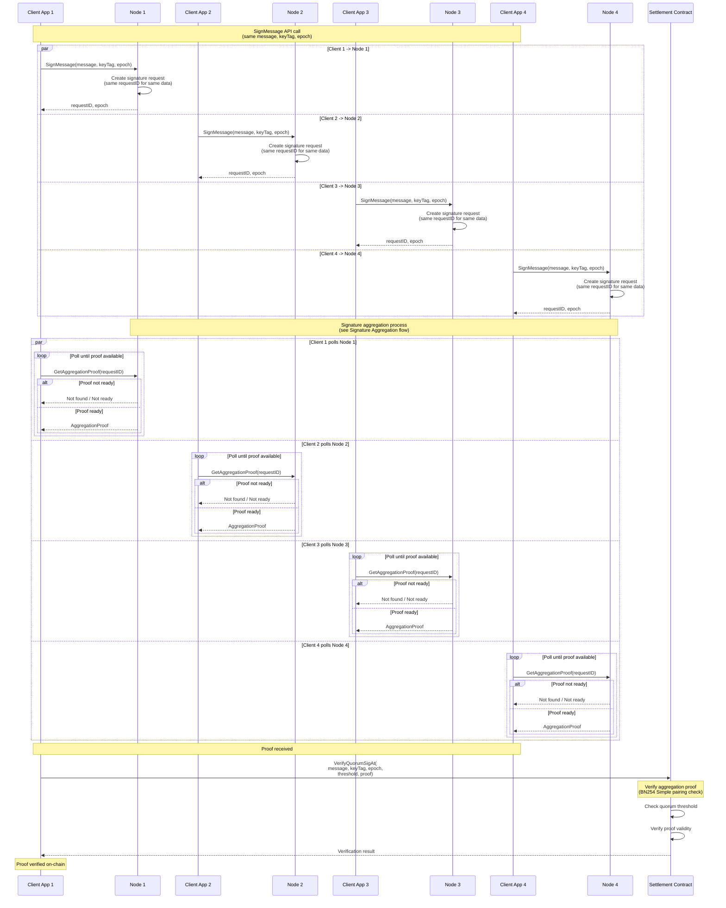

# Sign Message API

## Description

The Sign Message API allows client applications to request cryptographic signatures from the validator network. Each node has its own client application that calls the SignMessage API on that node. When all client applications call their respective nodes with the same message, key tag (see [`KeyTag`](./types.md#keytag)), and epoch, the nodes coordinate to produce an aggregation proof (see [`AggregationProof`](./types.md#aggregationproof)) that can be verified on-chain using settlement contracts.

### Process Overview

1. **API Request**: Each client application calls the SignMessage API endpoint on its respective node with:
   - The message to be signed
   - The key tag (see [`KeyTag`](./types.md#keytag)) specifying which validator keys should sign
   - The required epoch (or current epoch if not specified)

2. **Request Distribution**: Each node receives a SignMessage API call from its own client application. For the aggregation to work correctly, all client applications must call their nodes with exactly the same message, key tag, and epoch. This ensures all nodes generate the same request ID and coordinate on the same signature request.

3. **Signature Request Creation**: Each node creates a signature request (see [`SignatureRequest`](./types.md#signaturerequest)) internally. The request ID is deterministically calculated from the message hash, key tag, and epoch, ensuring all nodes generate the same request ID for identical inputs.

4. **Signature Aggregation**: The nodes follow the signature aggregation process (see [Signature Aggregation](./signature_aggregation.md)):
   - Signers sign the message
   - Signatures are collected via P2P
   - When quorum is reached, aggregators generate an aggregation proof

5. **Proof Retrieval**: Each client application can retrieve the aggregation proof from its own node using the GetAggregationProof API endpoint, providing the request ID returned from the SignMessage call.

6. **On-Chain Verification**: Any client application can verify the aggregation proof on-chain using settlement contracts. The settlement contract's `VerifyQuorumSigAt` function verifies:
   - The aggregation proof is valid (BN254 Simple pairing check)
   - The signers meet the quorum threshold
   - The proof corresponds to the specified epoch and message

### Key Features

- **Deterministic Request IDs**: Identical messages, key tags, and epochs produce the same request ID across all nodes, enabling coordination
- **Quorum-Based Signing**: Signatures are only aggregated when sufficient validator voting power has signed
- **On-Chain Verifiable**: Aggregation proofs can be verified on-chain using settlement contracts, enabling trustless verification
- **Multi-Node Coordination**: All nodes process the same request, ensuring consistent aggregation across the network
- **BN254 Simple**: Aggregation proofs use BN254 Simple aggregation for efficient on-chain verification

### Diagram

