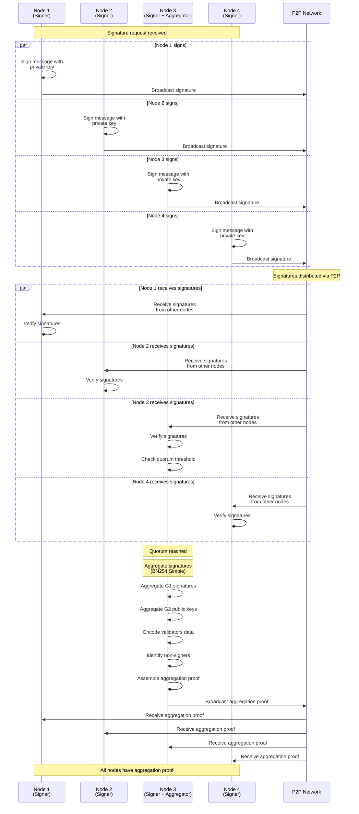

# Aggregation

## Description

The aggregation process generates aggregation proofs (see [`AggregationProof`](./types.md#aggregationproof)) from individual validator signatures (see [`Signature`](./types.md#signature)) when a quorum threshold is reached. This process enables the network to produce a single cryptographic proof representing the collective agreement of validators, which can be efficiently verified on-chain.

### Process Overview

1. **Signature Request Reception**: Each node receives a signature request (see [`SignatureRequest`](./types.md#signaturerequest)) (e.g., when a new validator set is derived). The request contains the message to be signed, the required key tag (see [`KeyTag`](./types.md#keytag)), and the epoch.

2. **Individual Signing**: Each node that is a signer for the requested key tag signs the message using their private key. The signature is then broadcast to other nodes via P2P network.

3. **Signature Collection**: Nodes receive signatures from other validators via P2P. Each signature is validated (verifying the signature against the validator's public key) and stored in the local database. The system tracks which validators have signed using a signature map.

4. **Quorum Check**: Aggregator nodes continuously monitor the signature map. When a new signature is processed, aggregators check if the total voting power of signers has reached the quorum threshold defined in the validator set.

5. **Aggregation Proof Generation**: Once quorum is reached, aggregator nodes generate an aggregation proof. For BN254 Simple aggregation:
   - All individual signatures are aggregated into a single G1 point
   - All signer public keys are aggregated into a single G2 point
   - Non-signer validators are identified and encoded
   - Validator data (keys, voting powers) is encoded
   - The proof is assembled containing: aggregated signature (G1), aggregated public key (G2), validators data, and non-signer indices

6. **Proof Broadcast**: The generated aggregation proof is broadcast via P2P network to all nodes, allowing them to verify and use the proof.

### Key Features

- **Quorum-Based**: Aggregation only occurs when sufficient voting power has signed, ensuring security and consensus
- **BLS Signature Aggregation**: Uses BLS (Boneh-Lynn-Shacham) signatures on BN254 curve, allowing efficient aggregation of multiple signatures into a single proof
- **Deterministic**: All aggregators produce the same proof from the same set of signatures, ensuring consistency across the network
- **Efficient Verification**: The aggregated proof can be verified on-chain with a single pairing check, regardless of the number of signers
- **Non-Signer Tracking**: The proof explicitly tracks which validators did not sign, allowing the verifier to calculate the effective signing voting power

### Diagram (BN254 Simple)

