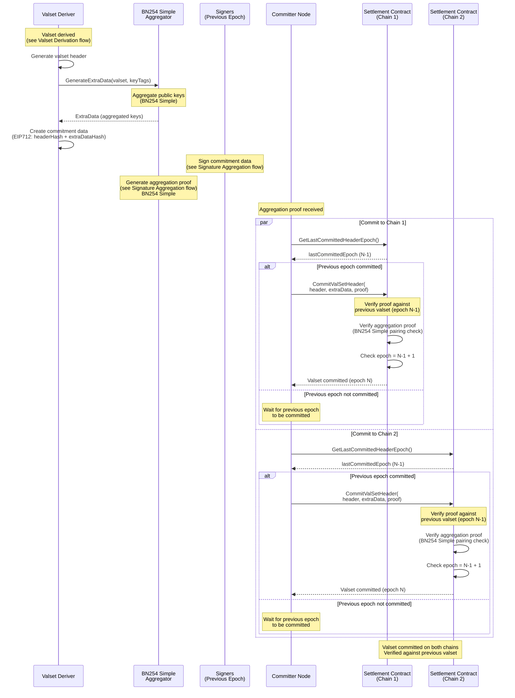

# Valset Commitment

## Description

The valset commitment process commits derived validator sets (see [`ValidatorSet`](./types.md#validatorset)) to settlement contracts on multiple chains, enabling cross-chain verification of validator set state. Each commitment includes a cryptographic proof (see [`AggregationProof`](./types.md#aggregationproof)) that verifies against the previous committed valset, ensuring continuity and security across epochs.

### Process Overview

1. **Valset Derivation**: A new validator set is derived for an epoch (see [Valset Derivation](./valset_derivation.md)). This process aggregates voting powers from multiple chains and forms the validator set according to network configuration.

2. **Header and Extra Data Generation**: Once a valset is derived:
   - The valset header (see [`ValidatorSetHeader`](./types.md#validatorsetheader)) is generated, containing epoch, quorum threshold, total voting power, and validators Merkle root
   - Extra data is generated using BN254 Simple aggregation, which aggregates the public keys of all validators for the required key tags
   - Commitment data is created as EIP712 typed data, combining the header hash and extra data hash

3. **Commitment Signing**: Signers from the previous epoch's validator set sign the commitment data. This creates a signature request (see [`SignatureRequest`](./types.md#signaturerequest)) that triggers the aggregation process (see [Signature Aggregation](./signature_aggregation.md)).

4. **Aggregation Proof Generation**: Once quorum is reached, an aggregation proof is generated using BN254 Simple aggregation, proving that sufficient validators from the previous epoch signed the commitment.

5. **Commitment to Settlement Contracts**: Committer nodes commit the valset to all configured settlement contracts:
   - Verifies that the previous epoch's valset is already committed on the settlement contract
   - Ensures consecutive epoch commitment (new epoch = last committed epoch + 1)
   - Submits the valset header, extra data, and aggregation proof to the settlement contract
   - The settlement contract verifies the aggregation proof against the previous committed valset

6. **Cross-Chain Verification**: Settlement contracts on different chains independently verify the same proof, ensuring consistency across all chains. Each contract maintains its own chain of committed valsets, with each new commitment verified against the previous one.

### Key Features

- **Sequential Commitment**: Each valset commitment must be consecutive (epoch N can only be committed after epoch N-1 is committed)
- **Proof Verification**: The aggregation proof is verified on-chain against the previous committed valset, ensuring cryptographic continuity
- **Multi-Chain Support**: The same valset is committed to multiple settlement contracts on different chains, enabling cross-chain state verification
- **BN254 Simple**: Both extra data (aggregated public keys) and aggregation proofs use BN254 Simple aggregation for efficient on-chain verification
- **Deterministic**: All committers produce the same commitment data, ensuring consistency across the network

> **Note**: The first valset header and extra data in settlement contracts must be set through the trusted genesis functionality. This establishes the initial state that all subsequent commitments will verify against.

### Diagram

