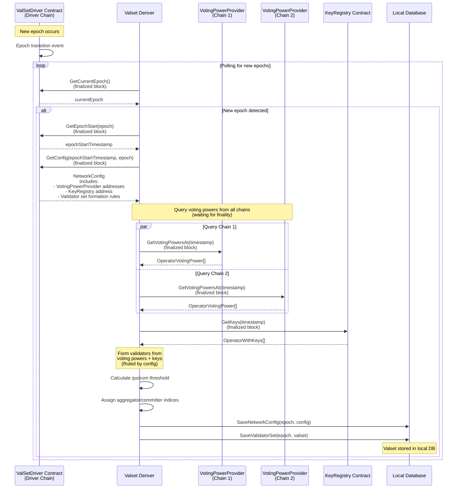

# Validator Set Derivation

## Description

The valset derivation process is responsible for computing and storing validator sets (see [`ValidatorSet`](./types.md#validatorset)) when new epochs occur in the ValSetDriver contract. This process ensures that the validator set accurately reflects the voting power distribution across multiple chains at a specific point in time.

### Process Overview

1. **Epoch Detection**: The system continuously polls the ValSetDriver contract to detect when a new epoch occurs. All contract calls use finalized blocks to ensure data consistency and prevent reorgs.

2. **Configuration Retrieval**: When a new epoch is detected, the system retrieves:
   - The epoch start timestamp
   - Network configuration (see [`NetworkConfig`](./types.md#networkconfig)) including:
     - VotingPowerProvider contract addresses (deployed on multiple chains)
     - KeyRegistry contract address
     - Validator set formation rules (min/max voting power, validator limits, etc.)

3. **Cross-Chain Voting Power Aggregation**: The system queries voting powers from all VotingPowerProvider contracts in parallel. These providers may be deployed on different chains, allowing the validator set to aggregate voting power across multiple networks. All queries use finalized blocks to ensure deterministic Validator Set.

4. **Key Retrieval**: The system fetches operator keys from the KeyRegistry contract at the epoch timestamp, again using finalized blocks.

5. **Validator Set Formation**: The deriver combines voting powers and keys to form validators according to the network configuration rules:
   - Filters validators by minimum voting power thresholds
   - Applies maximum voting power caps if configured
   - Limits the total number of validators if specified
   - Sorts validators by voting power

6. **Quorum and Role Assignment**: The system calculates the quorum threshold and deterministically assigns aggregator and committer roles pseudo-randomly based on the validator set hash.

### Key Features

- **Multi-Chain Support**: VotingPowerProviders can be deployed on different chains, with voting powers aggregated across all chains
- **Deterministic Derivation**: The validator set is deterministically derived from on-chain data from finalized state, ensuring all nodes derive the same set
- **Configuration-Driven**: Validator set formation follows rules defined in the network configuration, allowing for flexible governance

### Diagram

